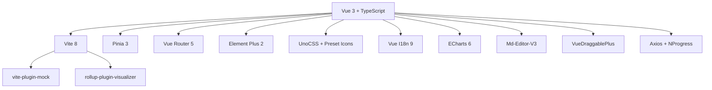
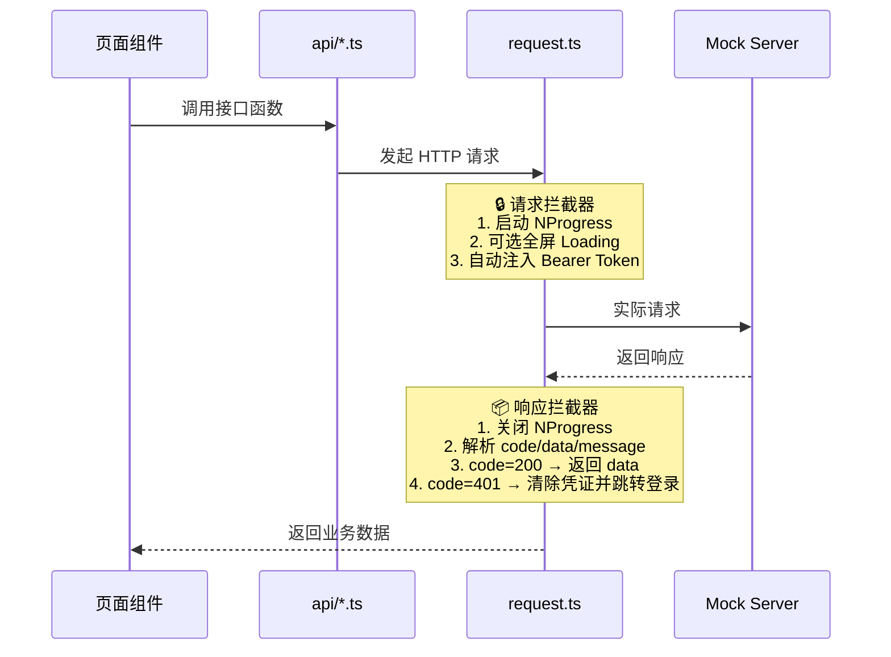
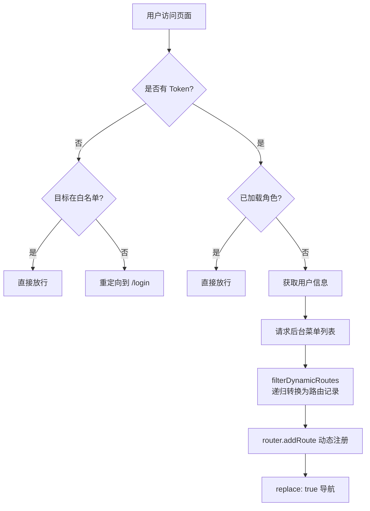

# Lighthouse Admin 项目技术文档

> **Lighthouse Admin** —— 基于 Vue3 生态构建的现代化个人管理后台。本文档旨在帮助团队成员、面试官或开源社区快速理解项目的架构设计与技术实现。

---

## 一、项目概览

|   项目     |   说明   |
| :--------: | :------: |
| **项目名称** | Lighthouse Admin |
| **定位** | 全功能个人管理后台 |
| **核心框架** | Vue 3.5 (Script Setup) + TypeScript 5.9 |
| **构建工具** | Vite 8 |
| **包管理** | npm |
| **Node 版本** | ≥ 18 (推荐 20+) |
| **仓库地址** | [Jokerilya/Lighthouse-Admin](https://github.com/Jokerilya/Lighthouse-Admin) |

---

## 二、技术栈全景



| 分类 | 技术选型 | 版本 | 用途 |
| :--- | :------- | :--- | :--- |
| **核心框架** | Vue 3 | 3.5.30 | 响应式 UI 框架 |
| **类型系统** | TypeScript | 5.9.3 | 静态类型检查 |
| **构建工具** | Vite | 8.0.0 | 开发服务器 & 打包 |
| **状态管理** | Pinia | 3.0.4 | 模块化全局状态 |
| **路由** | Vue Router | 5.0.3 | SPA 路由管理 |
| **UI 组件库** | Element Plus | 2.13.5 | 全套 UI 组件 |
| **原子化 CSS** | UnoCSS | 66.6.6 | 按需生成 CSS 工具类 |
| **图标** | @iconify-json/ep | 1.2.4 | Element Plus 图标集 |
| **数据可视化** | ECharts | 6.0.0 | 折线图、饼图等图表 |
| **Markdown** | Md-Editor-V3 | 6.4.0 | 所见即所得 Markdown 编辑 |
| **拖拽** | VueDraggablePlus | 0.6.1 | 列表拖拽排序 |
| **HTTP 客户端** | Axios | 1.13.6 | 接口请求 |
| **数据模拟** | Mock.js + vite-plugin-mock | 1.1.0 / 3.0.2 | 内存级接口仿真 |
| **国际化** | Vue I18n | 9.14.5 | 中英文切换 |
| **日期** | Day.js | 1.11.20 | 日期格式化 |
| **工具库** | @vueuse/core | 14.2.1 | 组合式 API 工具集 |
| **打包分析** | rollup-plugin-visualizer | 7.0.1 | 可视化产物体积 |

---

## 三、目录结构

```text
lighthouse-admin/
├── public/                  # 静态资源
├── src/
│   ├── api/                 # 接口定义层（7 个模块）
│   │   ├── dept.ts          #   部门管理接口
│   │   ├── dict.ts          #   数据字典接口
│   │   ├── menu.ts          #   菜单管理接口
│   │   ├── notebook.ts      #   周报/记事本接口
│   │   ├── role.ts          #   角色管理接口
│   │   ├── todo.ts          #   任务清单接口
│   │   └── user.ts          #   用户管理接口
│   ├── assets/              # 图片、字体等资源
│   ├── components/          # 全局通用组件
│   │   ├── DictSelect/      #   数据字典下拉选择器
│   │   ├── Spotlight/       #   全局搜索弹窗 (Ctrl+K)
│   │   └── ThemeSwitch/     #   暗黑模式切换器
│   ├── directives/          # 自定义指令
│   │   └── permission.ts    #   按钮权限指令 v-hasPerm
│   ├── hooks/               # 自定义组合式函数
│   │   ├── useTable.ts      #   通用表格逻辑（分页/查询/重置）
│   │   └── useWatermark.ts  #   全局防篡改水印
│   ├── layout/              # 系统主框架布局
│   │   ├── index.vue        #   主布局容器
│   │   └── components/      #   侧边栏、顶栏、多页签等
│   ├── locales/             # 国际化语言包
│   │   ├── zh-CN.json       #   中文
│   │   ├── en-US.json       #   英文
│   │   └── index.ts         #   i18n 初始化
│   ├── mock/                # Mock 数据仿真中心（8 个模块）
│   │   ├── login.ts         #   登录认证
│   │   ├── user.ts          #   用户管理
│   │   ├── role.ts          #   角色管理
│   │   ├── menu.ts          #   菜单管理
│   │   ├── dept.ts          #   部门管理
│   │   ├── dict.ts          #   数据字典
│   │   ├── todo.ts          #   任务清单
│   │   └── notebook.ts      #   周报/记事本
│   ├── router/              # 路由配置
│   │   ├── index.ts         #   基础路由表 & Hash 模式
│   │   └── permission.ts    #   全局路由守卫
│   ├── store/               # Pinia 状态管理
│   │   ├── user.ts          #   用户信息 & Token
│   │   ├── app.ts           #   应用 UI 状态
│   │   ├── permission.ts    #   动态菜单列表
│   │   └── tagsView.ts      #   多页签缓存
│   ├── styles/              # 全局样式
│   │   └── index.scss       #   全局 SCSS 入口
│   ├── utils/               # 工具函数
│   │   ├── request.ts       #   Axios 二次封装
│   │   └── permission.ts    #   动态路由转换
│   ├── views/               # 业务页面
│   │   ├── dashboard/       #   📊 数据仪表盘
│   │   ├── login/           #   🔐 登录页
│   │   ├── system/          #   ⚙️ 系统管理（用户/角色/菜单/部门/字典）
│   │   ├── todo/            #   ✅ 任务清单
│   │   ├── notebook/        #   📝 个人周报 / 记事本
│   │   ├── finance/         #   💰 理财看板
│   │   └── error/           #   🚫 404 页面
│   ├── App.vue              # 根组件
│   ├── main.ts              # 应用入口
│   ├── mockProdServer.ts    # 生产环境 Mock 启动器
│   └── style.css            # 基础全局样式
├── index.html               # HTML 入口
├── vite.config.ts           # Vite 配置
├── uno.config.ts            # UnoCSS 配置
├── tsconfig.json            # TypeScript 配置
└── package.json             # 依赖 & 脚本
```

---

## 四、核心架构设计

### 4.1 Axios 二次封装

> 文件位置：`src/utils/request.ts`



**核心要点：**
- 统一的 `ApiResponse<T>` 泛型接口定义
- 自动从 `localStorage` 读取 Token 并注入 `Authorization` 请求头
- 401 状态码自动清除本地缓存、重定向登录页
- 支持按需开启全屏 `ElLoading`（通过 `config.loading` 标志位）

### 4.2 路由与权限体系

> 文件位置：`src/router/index.ts`、`src/router/permission.ts`、`src/utils/permission.ts`



**设计亮点：**
- **白名单机制**：`/login` 等公开页面无需认证即可访问
- **动态路由**：通过 `import.meta.glob('../views/**/*.vue')` 预加载所有页面组件，再由后台菜单数据驱动路由注册
- **Hash 模式**：使用 `createWebHashHistory()` 确保静态部署兼容性（如 GitHub Pages）

### 4.3 状态管理（Pinia）

系统共 4 个 Store 模块，各司其职：

| Store | 文件 | 职责 |
| :---- | :--- | :--- |
| `useUserStore` | `store/user.ts` | 管理 Token 持久化、用户信息、角色权限列表 |
| `useAppStore` | `store/app.ts` | 控制侧边栏折叠等全局 UI 状态 |
| `usePermissionStore` | `store/permission.ts` | 存储后台返回的原始菜单树，供侧边栏渲染 |
| `useTagsViewStore` | `store/tagsView.ts` | 支撑多页签系统：已访问列表 + Keep-Alive 缓存列表 |

### 4.4 自定义 Hooks

#### `useTable` — 通用表格逻辑

将列表页面中重复的查询、分页、加载等逻辑高度抽象：

```typescript
const {
  tableData,    // 表格数据
  loading,      // 加载状态
  total,        // 总条数
  pagination,   // 分页参数 { currentPage, pageSize }
  queryParams,  // 查询参数
  getList,      // 获取数据
  handleQuery,  // 查询（自动重置到第 1 页）
  handleReset,  // 重置搜索条件
  handleSizeChange,     // 每页条数变更
  handleCurrentChange   // 当前页变更
} = useTable(apiFunction, initialParams)
```

#### `useWatermark` — 全局防篡改水印

- 通过 **Canvas** 动态生成带旋转角度的半透明文字水印
- 使用 **MutationObserver** 监听 DOM 变化，防止用户通过控制台删除或修改水印节点
- 组件卸载时自动清理水印

### 4.5 按钮级权限指令

> 文件位置：`src/directives/permission.ts`

```html
<!-- 用法示例 -->
<el-button v-hasPerm="['system:user:add']">新增用户</el-button>
```

- 在 `mounted` 钩子中，读取 `useUserStore` 中的 `permissions` 数组
- 校验传入的权限标识是否匹配。若用户持有 `*`（超级管理员），则放行所有操作
- 无权限时，直接从 DOM 中移除该元素

### 4.6 Mock 数据仿真

> 文件位置：`src/mock/`

项目采用 `vite-plugin-mock` 驱动的 **内存级有状态 Mock** 方案：

- **模块级变量**维护数据，支持真实的增删改查操作（非简单的静态 JSON 返回）
- 覆盖 **8 大业务模块**：登录认证、用户管理、角色管理、菜单管理、部门管理、数据字典、任务清单、周报/记事本
- **生产环境兼容**：通过 `mockProdServer.ts` 支持构建产物中继续使用 Mock 数据

### 4.7 国际化（i18n）

- 使用 `vue-i18n` 实现中英文一键切换
- 语言包位于 `src/locales/zh-CN.json` 和 `src/locales/en-US.json`
- 同步切换 Element Plus 组件库内置语言

### 4.8 UnoCSS 配置

- **preset-uno**：标准原子化 CSS 工具类
- **preset-icons**：以 `i-ep-*` 前缀按需引入 Element Plus 图标，无需手动导入组件
- **自定义快捷键**：`flex-center`、`flex-between`、`full-page` 等语义化类名
- **安全列表**：确保动态绑定的图标类名不被 Tree-Shaking 移除

---

## 五、业务模块说明

### 5.1 🔐 登录与鉴权

- 账号密码表单校验
- Mock 模拟登录接口，返回 Token
- 登录成功后写入 `localStorage`，触发动态路由加载
- 退出登录清除所有状态与缓存

### 5.2 📊 数据仪表盘（Dashboard）

- 顶部展示统计卡片（任务完成数、学习时长等关键指标）
- 中部 ECharts 折线图展示趋势数据
- **Resize 适配**：监听侧边栏折叠事件，自动触发图表重绘

### 5.3 ⚙️ 系统管理

| 子模块 | 功能描述 |
| :----- | :------- |
| **用户管理** | 基于 `useTable` 的完整 CRUD，支持多条件搜索、批量删除、状态切换 |
| **角色管理** | 角色增删改查，通过树形组件分配菜单和按钮权限 |
| **菜单管理** | 动态配置侧边栏菜单树（目录 / 菜单 / 按钮三级类型） |
| **部门管理** | 无限层级树形表格，用户隶属于角色 + 部门双维度 |
| **数据字典** | 全局下拉枚举值维护，前端通过 Dict Code 自动渲染选项 |

### 5.4 ✅ 任务清单（Todo List）

- **拖拽排序**：集成 `VueDraggablePlus` 实现任务拖拽交互
- **优先级色彩**：高/中/低优先级通过不同颜色标识
- **状态同步**：完成/未完成即时切换

### 5.5 📝 个人周报 / 记事本（Notebook）

- 集成 `Md-Editor-V3` 生产级 Markdown 编辑器
- **双栏布局**：左侧历史版本列表 + 右侧实时预览
- **自动标题推导**：从 Markdown 内容中提取首行标题

### 5.6 💰 理财看板（Finance）

- 资产配比展示（ECharts 饼图）
- 收益曲线波动图

---

## 六、系统主框架布局

```text
┌─────────────────────────────────────────────────────────┐
│  Header: 面包屑 │ 全局搜索(Ctrl+K) │ 主题切换 │ 国际化 │ 用户头像  │
├──────┬──────────────────────────────────────────────────┤
│      │  TagsView: [仪表盘] [用户管理] [任务清单] ...      │
│  S   ├──────────────────────────────────────────────────┤
│  i   │                                                    │
│  d   │                                                    │
│  e   │               Main Content                        │
│  b   │            (keep-alive 缓存)                       │
│  a   │                                                    │
│  r   │                                                    │
│      │                                                    │
├──────┴──────────────────────────────────────────────────┤
│                    全局水印层 (z-index: 9999)              │
└─────────────────────────────────────────────────────────┘
```

**关键组件：**
- **Sidebar**：基于 `el-menu` 递归渲染，支持多级嵌套菜单和折叠切换
- **Header**：面包屑导航 + `Spotlight` 全局搜索 + `ThemeSwitch` 暗黑模式 + 用户下拉菜单
- **TagsView**：多页签导航，支持右键菜单（关闭当前/其他/全部），底层通过 `keep-alive` + Pinia 维护缓存
- **Watermark**：全局水印覆盖层，防截图泄露

---

## 七、全局组件

| 组件名 | 路径 | 功能 |
| :----- | :--- | :--- |
| `DictSelect` | `components/DictSelect/` | 数据字典下拉选择器。传入字典编码自动渲染选项 |
| `Spotlight` | `components/Spotlight/` | 全局搜索弹窗。`Ctrl+K` 快捷键唤起，支持菜单/功能搜索 |
| `ThemeSwitch` | `components/ThemeSwitch/` | 暗黑模式一键切换。联动 Element Plus CSS 变量和 ECharts 主题 |

---

## 八、开发与部署

### 8.1 环境准备

```bash
# 1. 安装依赖
npm install

# 2. 启动开发服务器（默认 http://localhost:3000）
npm run dev

# 3. 构建生产包
npm run build

# 4. 本地预览构建产物
npm run preview
```

### 8.2 环境变量

通过项目根目录 `.env` 文件配置：

| 变量名 | 说明 |
| :----- | :--- |
| `VITE_APP_BASE_API` | 接口请求基础路径，默认 `/api` |

### 8.3 构建配置要点

| 配置项 | 说明 |
| :----- | :--- |
| `base: './'` | 相对路径，兼容 GitHub Pages 等非根目录部署 |
| `viteMockServe` | Mock 服务在开发和生产环境均可用 |
| `rollup-plugin-visualizer` | 构建后自动生成 `stats.html` 体积分析报告 |
| 路径别名 `@` | 指向 `src/` 目录 |
| 开发服务器 | `host: 0.0.0.0`，`port: 3000`，启动自动打开浏览器 |

### 8.4 部署方式

项目采用 Hash 路由模式（`createWebHashHistory`），可直接部署为静态资源：

1. **GitHub Pages** — 构建后上传 `dist/` 目录
2. **Vercel** — 连接 GitHub 仓库自动部署
3. **Nginx** — 将 `dist/` 作为静态文件根目录，无需额外 SPA 重写规则

---

## 九、技术亮点总结

| 亮点 | 说明 |
| :--- | :--- |
| 🏗️ **动态路由** | 后台菜单数据驱动，`import.meta.glob` + `addRoute` 动态注册 |
| 🔐 **RBAC 权限** | 按钮级 `v-hasPerm` 指令 + 菜单级动态路由双控 |
| 🪝 **自定义 Hook** | `useTable` 将表格 CRUD 逻辑抽象为极简调用 |
| 💧 **防篡改水印** | Canvas 生成 + MutationObserver 防删除 |
| 📊 **有状态 Mock** | 内存级数据持久化，完整模拟增删改查 |
| 🌗 **暗黑模式** | UnoCSS `dark:` + Element Plus CSS 变量 + ECharts 主题联动 |
| 🔍 **全局搜索** | Spotlight 组件，`Ctrl+K` 唤起，菜单/功能快速定位 |
| 🌐 **国际化** | Vue I18n + Element Plus 语言包动态切换 |
| 📏 **打包分析** | rollup-plugin-visualizer 可视化产物体积 |

---

*最后更新：2026-03-17*
